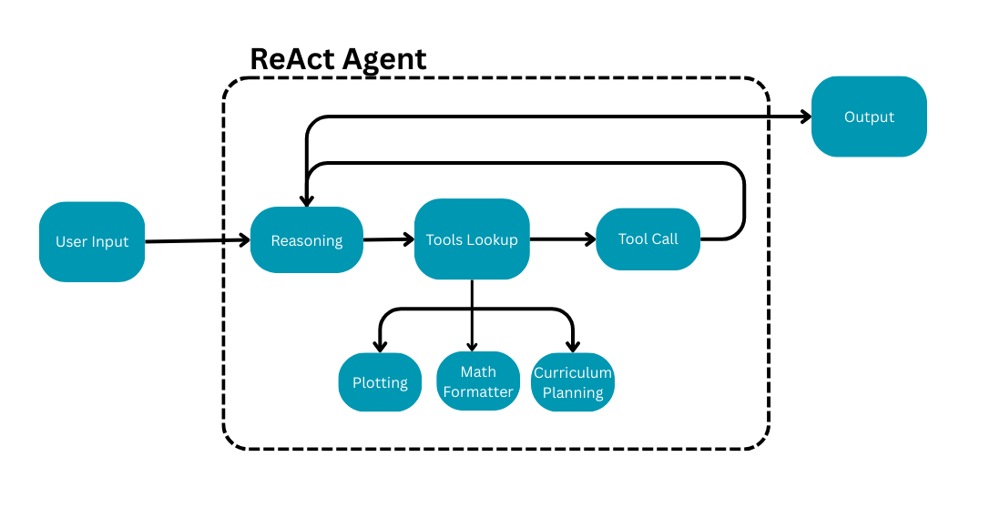

# math-tutor
This is our final project for the NLP Systems. We developed an Agentic LLM mean to for tutoring middle school aged children with math problems. This LLM acts as a tutor by reasoning
and planning the steps for solving a math problem, and providing LaTeX formulas to guide the user to solve the problem.

Ben Lambright, Sunny Zhou, Jordan Youner

## Features
- Front-end chatbot interface
- Integrating a LaTeX and planning tool to improve outputs for solving math problems and generating formulas
- Dockerized for ease of use

## Model Architecture
See our report for a more detailed explanation, but here is the general architecture of our model


## Repo Structure
```text
math-tutor/
├── agent.py               # model
├── app.py                 # runs the Flask app
├── agent_test.py          # Example test script for the agent
├── conversation_test.py   # Another example test for conversation flow
├── images/
│   └── User_Input.png     
├── templates/
│   └── index.html         
├── Dockerfile             
├── README.md              
├── requirements.txt       
├── secrets.txt            # API keys (do NOT commit publicly)
├── tools.py               # toolkits for model
└── utils.py               
```


## Use 
Clone the repo, and cd to the directory. Once you are cd'ed into the directory, you can run the following commands.

Build the docker app
```shell
# Build the image
docker build -t math_tutor .
```
Once you have run the Docker app, make sure to run the image as so, in order for you to be able to access the port:
```shell
# Run the image
docker run -p [PORT]:5000 math_tutor
```
Finally, you should be able to access the website on the following page: `localhost:[PORT]`
